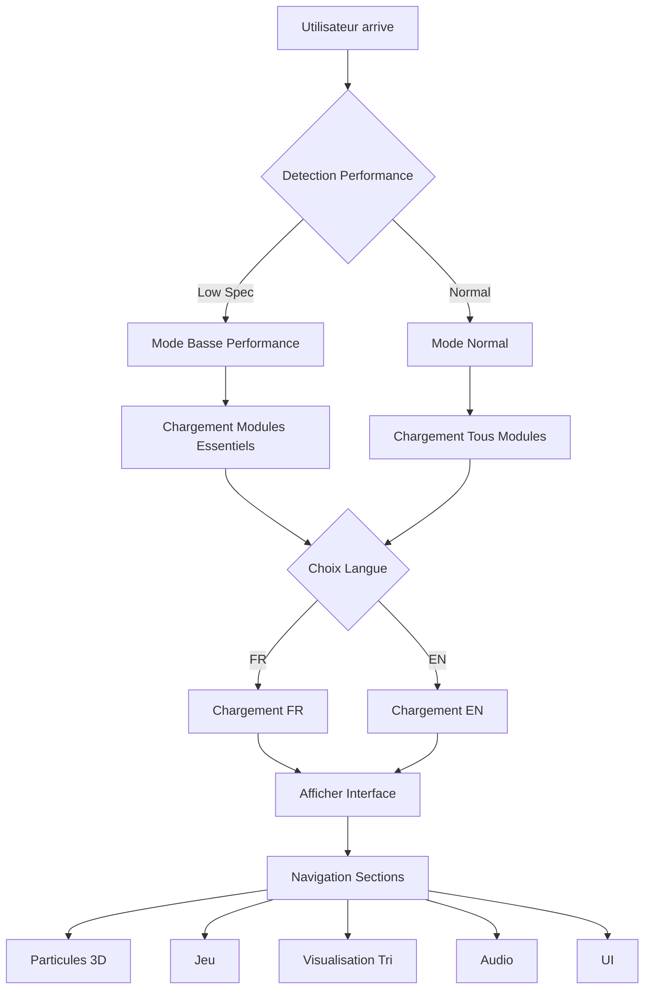
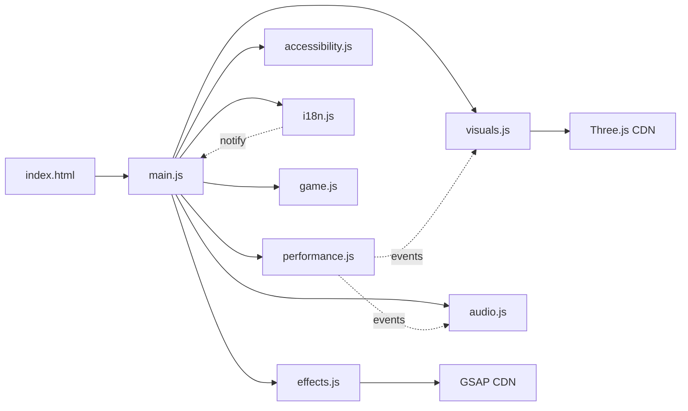

# Architecture de l'Ultimate Showcase V3

## Document d'Architecture Technique

**Version :** 3.0  
**Date :** 14 Décembre 2025  
**Public Cible :** Développeurs et Tech Leads  
**Approche :** Pédagogique avec démonstrations techniques  
**Style Visuel :** Futuriste avec effets néon et particules  

---

## Table des Matières

1. [Vue d'ensemble](#1-vue-densemble)
2. [Structure des Fichiers](#2-structure-des-fichiers)
3. [Sections Interactives](#3-sections-interactives)
4. [Technologies et CDN](#4-technologies-et-cdn)
5. [Architecture JavaScript](#5-architecture-javascript)
6. [Système d'Internationalisation](#6-système-dinternationalisation)
7. [Accessibilité (a11y)](#7-accessibilité-a11y)
8. [Mode Low-Spec](#8-mode-low-spec)
9. [Performance et Optimisation](#9-performance-et-optimisation)
10. [Documentation](#10-documentation)

---

## 1. Vue d'ensemble

### 1.1 Objectifs du Projet

L'Ultimate Showcase V3 est une application front-end statique monolithique conçue pour démontrer des techniques avancées de développement web tout en restant pédagogique. L'application vise à :

- **Démontrer** des compétences techniques variées (3D, audio, animations, jeux, visualisation)
- **Éduquer** par des explications claires et des commentaires détaillés
- **Impressionner** avec un design futuriste et des interactions fluides
- **Respecter** les standards d'accessibilité et de performance

### 1.2 Principes Architecturaux

- **Modularité** : Chaque fonctionnalité est isolée dans son propre module
- **Performance** : Chargement différé et mode basse consommation
- **Accessibilité** : Conforme WCAG 2.1 AA minimum
- **Maintenabilité** : Code commenté et structure claire
- **Internationalisation** : Support natif EN/FR extensible

### 1.3 Architecture Générale

```
┌─────────────────────────────────────────────────────────────┐
│                     index.html (Entry Point)                │
├─────────────────────────────────────────────────────────────┤
│  CSS Modules                    │  JavaScript Modules       │
│  ├─ style.css                  │  ├─ main.js               │
│  ├─ animations.css             │  ├─ visuals.js (Three.js) │
│  └─ theme.css                  │  ├─ effects.js (GSAP)     │
│                                 │  ├─ game.js               │
│  Assets                         │  ├─ audio.js              │
│  ├─ images/                    │  ├─ performance.js        │
│  ├─ fonts/                     │  ├─ accessibility.js      │
│  └─ models/                    │  └─ i18n.js               │
│                                                              │
│  Content                        │  Configuration            │
│  ├─ article.md                 │  └─ manifest.json         │
│  └─ README.md                  │                           │
└─────────────────────────────────────────────────────────────┘
```

---

## 2. Structure des Fichiers

### 2.1 Arborescence Complète

```
ultimate-showcase-v3/
│
├── index.html                      # Point d'entrée principal
├── manifest.json                   # Configuration PWA
├── favicon.ico                     # Icône du site
│
├── css/                            # Styles CSS
│   ├── style.css                   # Styles principaux
│   ├── animations.css              # Animations CSS natives
│   ├── theme.css                   # Variables et thèmes
│   └── layout.css                  # Layout et grilles
│
├── js/                             # Scripts JavaScript
│   ├── main.js                     # Initialisation et coordination
│   ├── visuals.js                  # Three.js et effets 3D
│   ├── effects.js                  # Animations GSAP
│   ├── game.js                     # Jeu de réaction
│   ├── audio.js                    # Web Audio API
│   ├── performance.js              # Gestion performance
│   ├── accessibility.js            # Gestion a11y
│   └── i18n.js                     # Internationalisation
│
├── i18n/                           # Fichiers de traduction
│   ├── en.json                     # Anglais
│   └── fr.json                     # Français
│
├── assets/                         # Ressources statiques
│   ├── images/                     # Images optimisées
│   │   ├── hero-bg.webp
│   │   ├── section-icons/
│   │   └── ui/
│   ├── fonts/                      # Polices custom
│   │   ├── futura.woff2
│   │   └── monospace.woff2
│   └── models/                     # Modèles 3D (optionnel)
│
├── article.md                      # Article technique (700-1000 mots)
├── README.md                       # Documentation du projet
└── ARCHITECTURE_V3.md             # Ce document
```

### 2.2 Description des Fichiers Clés

#### `index.html`
- Structure HTML5 sémantique
- Balises `<main>`, `<section>`, `<article>`, `<nav>`, `<header>`, `<footer>`
- Attributs ARIA complets
- Métadonnées SEO optimisées
- Liens vers CDN et fichiers locaux

#### `css/style.css`
- Reset CSS moderne
- Variables CSS (Custom Properties)
- Classes utilitaires
- Styles responsives
- Support dark/light mode

#### `js/main.js`
- Point d'entrée JavaScript
- Gestion des événements globaux
- Coordination des modules
- Initialisation différée

---

## 3. Sections Interactives

### 3.1 Section 1 : Creative Coding - Particules 3D

**Objectif :** Démontrer la maîtrise de Three.js et du WebGL

**Fonctionnalités :**
- Système de particules 3D (1000+ particules)
- Interactions souris (attraction/répulsion)
- Contrôles utilisateur :
  - Nombre de particules (100-2000)
  - Vitesse d'animation
  - Couleurs (gradients configurables)
  - Formes (sphères, cubes, étoiles)
- Mode "Orbit" automatique
- Informations FPS en temps réel

**Technologies :**
- Three.js (particules, shaders)
- WebGL (accélération GPU)
- GSAP (transitions fluides)

**Implémentation :**
```javascript
// visuals.js
class ParticleSystem {
  constructor(container, options = {}) {
    this.particleCount = options.count || 1000;
    this.geometry = new THREE.BufferGeometry();
    this.material = new THREE.PointsMaterial({
      size: 2,
      color: 0x00ffff,
      transparent: true,
      opacity: 0.8
    });
    this.points = new THREE.Points(this.geometry, this.material);
  }
  
  update(deltaTime) {
    // Animation des particules
  }
  
  handleMouseInteraction(x, y) {
    // Interaction souris
  }
}
```

### 3.2 Section 2 : Mini-Game - Aim Trainer

**Objectif :** Démontrer la gestion d'événements et l'animation performante

**Fonctionnalités :**
- Jeu de précision et rapidité
- Cibles apparaissant aléatoirement
- Timer de 30 secondes
- Score en temps réel
- Difficulté progressive
- Feedback visuel et sonore
- Leaderboard local (localStorage)

**Technologies :**
- Canvas API (dessin des cibles)
- GSAP (animations)
- Web Audio API (sons)

**Implémentation :**
```javascript
// game.js
class AimTrainer {
  constructor(canvas) {
    this.canvas = canvas;
    this.ctx = canvas.getContext('2d');
    this.targets = [];
    this.score = 0;
    this.timeLeft = 30;
    this.isPlaying = false;
  }
  
  spawnTarget() {
    // Création d'une cible aléatoire
  }
  
  handleClick(x, y) {
    // Vérification du clic sur cible
  }
  
  update() {
    // Mise à jour du jeu
  }
}
```

### 3.3 Section 3 : Data Visualization - Algorithme de Tri

**Objectif :** Visualiser pédagogiquement les algorithmes de tri

**Fonctionnalités :**
- Visualisation de 5 algorithmes :
  - Bubble Sort
  - Quick Sort
  - Merge Sort
  - Selection Sort
  - Insertion Sort
- Contrôles :
  - Sélection de l'algorithme
  - Taille du tableau (10-100 éléments)
  - Vitesse d'animation
  - Pause/Reprise
- Explications en temps réel
- Comparaison de performances

**Technologies :**
- Chart.js (graphiques)
- Canvas API (dessin des barres)
- Async/await (contrôle de l'animation)

**Implémentation :**
```javascript
// Dans le module de visualisation
class SortingVisualizer {
  constructor(container) {
    this.data = [];
    this.algorithm = 'bubble';
    this.isSorting = false;
    this.speed = 50; // ms
  }
  
  async visualizeSort() {
    const algorithm = this.getAlgorithm(this.algorithm);
    for (const step of algorithm(this.data)) {
      if (!this.isSorting) break;
      this.render(step);
      await this.sleep(this.speed);
    }
  }
  
  generateRandomData(size) {
    // Génération de données aléatoires
  }
}
```

### 3.4 Section 4 : Audio Experience - Visualiseur Audio

**Objectif :** Démontrer la Web Audio API et la synchronicité

**Fonctionnalités :**
- Analyseur de fréquence en temps réel
- Microphone ou fichier audio
- 3 modes de visualisation :
  - Barres de fréquence
  - Cercle de particules
  - Waveform
- Égaliseur 5 bandes
- Effets audio (reverb, delay)
- Beat detection

**Technologies :**
- Web Audio API (AnalyzerNode, GainNode)
- Canvas API (visualisation)
- getUserMedia (microphone)

**Implémentation :**
```javascript
// audio.js
class AudioVisualizer {
  constructor() {
    this.audioContext = new (window.AudioContext || window.webkitAudioContext)();
    this.analyser = this.audioContext.createAnalyser();
    this.analyser.fftSize = 2048;
    this.dataArray = new Uint8Array(this.analyser.frequencyBinCount);
  }
  
  async initMicrophone() {
    const stream = await navigator.mediaDevices.getUserMedia({ audio: true });
    const source = this.audioContext.createMediaStreamSource(stream);
    source.connect(this.analyser);
  }
  
  visualize() {
    this.analyser.getByteFrequencyData(this.dataArray);
    // Dessin sur canvas
  }
}
```

### 3.5 Section 5 : UI/Design - Interface Futuriste

**Objectif :** Démontrer les animations CSS/JS avancées et le design system

**Fonctionnalités :**
- Dark/Light mode animé
- Effets de transition fluides
- Hover states élaborés
- Loading states animés
- Glassmorphism
- Animations de particules CSS
- Thème néon avec glow effects
- Navigation sticky avec indicateur de progression

**Technologies :**
- CSS Custom Properties (variables de thème)
- CSS Animations (@keyframes)
- GSAP (animations complexes)
- Intersection Observer API

**Implémentation :**
```css
/* theme.css */
:root {
  --primary-color: #00ffff;
  --secondary-color: #ff00ff;
  --bg-dark: #0a0a14;
  --bg-light: #f0f0ff;
  --text-primary: #ffffff;
  --text-secondary: #a0a0ff;
  --glow-intensity: 0 0 20px;
}

[data-theme="dark"] {
  --bg-primary: var(--bg-dark);
  --text-primary: #ffffff;
}

[data-theme="light"] {
  --bg-primary: var(--bg-light);
  --text-primary: #000000;
}

.neon-glow {
  box-shadow: 
    var(--glow-intensity) var(--primary-color),
    inset 0 0 20px rgba(0, 255, 255, 0.2);
  animation: pulse 2s infinite alternate;
}
```

---

## 4. Technologies et CDN

### 4.1 Bibliothèques JavaScript

#### Three.js (3D)
```html
<script src="https://cdnjs.cloudflare.com/ajax/libs/three.js/r128/three.min.js"></script>
```
- **Version :** r128 (stable)
- **Usage :** Système de particules 3D
- **Alternative locale :** Oui (backup)

#### GSAP (Animations)
```html
<script src="https://cdnjs.cloudflare.com/ajax/libs/gsap/3.12.2/gsap.min.js"></script>
```
- **Version :** 3.12.2
- **Usage :** Animations fluides et performantes
- **Plugins :** ScrollTrigger, TextPlugin

#### Chart.js (Visualisation)
```html
<script src="https://cdnjs.cloudflare.com/ajax/libs/Chart.js/4.4.0/chart.min.js"></script>
```
- **Version :** 4.4.0
- **Usage :** Graphiques pour comparaisons d'algorithmes

### 4.2 APIs Natives

- **Canvas API** : Dessin 2D (jeu, visualisations)
- **Web Audio API** : Analyse et traitement audio
- **WebGL** : Accélération 3D (via Three.js)
- **Intersection Observer API** : Détection de scroll
- **localStorage** : Sauvegarde des scores et préférences

### 4.3 CSS Modernes

- **CSS Custom Properties** : Variables de thème
- **CSS Grid** : Layout principal
- **CSS Flexbox** : Alignements
- **CSS Animations** : Transitions fluides
- **CSS Filters** : Effets visuels

### 4.4 Stratégie de Chargement

```html
<!-- Préchargement des polices -->
<link rel="preload" href="/assets/fonts/futura.woff2" as="font" type="font/woff2" crossorigin>

<!-- Chargement différé des scripts non critiques -->
<script src="js/main.js" defer></script>
<script src="https://cdnjs.cloudflare.com/ajax/libs/three.js/r128/three.min.js" defer></script>

<!-- Module type pour les navigateurs modernes -->
<script type="module" src="js/visuals.js"></script>
```

---

## 5. Architecture JavaScript

### 5.1 Organisation des Modules

```
js/
├── main.js              # Coordinateur principal
├── visuals.js           # Three.js et particules 3D
├── effects.js           # Animations GSAP
├── game.js              # Jeu de réaction
├── audio.js             # Web Audio API
├── performance.js       # Détection et optimisation
├── accessibility.js     # Gestion a11y
└── i18n.js             # Traductions
```

### 5.2 Pattern d'Architecture

**Pattern utilisé :** Module Pattern avec révélateur (Revealing Module Pattern)

```javascript
// main.js - Coordinateur
const App = (() => {
  // Variables privées
  let currentSection = 0;
  let isLowSpec = false;
  
  // Initialisation
  const init = () => {
    Performance.init();
    Accessibility.init();
    i18n.init();
    Visuals.init();
    Game.init();
    Audio.init();
    bindEvents();
  };
  
  // Liaison des événements
  const bindEvents = () => {
    document.addEventListener('DOMContentLoaded', init);
    window.addEventListener('resize', handleResize);
  };
  
  // Gestion du redimensionnement
  const handleResize = () => {
    Visuals.resize();
    Game.resize();
  };
  
  // Révélation publique
  return {
    init,
    currentSection: () => currentSection,
    isLowSpec: () => isLowSpec
  };
})();
```

### 5.3 Communication entre Modules

**Pattern :** Événements personnalisés (Custom Events)

```javascript
// Dans performance.js
const Performance = (() => {
  const detectLowSpec = () => {
    const isLowEnd = navigator.hardwareConcurrency < 4 || 
                     navigator.deviceMemory < 4;
    
    if (isLowEnd) {
      document.dispatchEvent(new CustomEvent('lowSpecDetected', {
        detail: { reason: 'hardware' }
      }));
    }
  };
  
  return { detectLowSpec };
})();

// Dans visuals.js
document.addEventListener('lowSpecDetected', (e) => {
  Visuals.enableLowSpecMode();
});
```

### 5.4 Gestion des États

**Pattern :** State Machine simple

```javascript
// game.js
const GameState = {
  IDLE: 'idle',
  PLAYING: 'playing',
  PAUSED: 'paused',
  FINISHED: 'finished'
};

class AimTrainer {
  constructor() {
    this.state = GameState.IDLE;
  }
  
  start() {
    if (this.state === GameState.IDLE) {
      this.state = GameState.PLAYING;
      this.gameLoop();
    }
  }
  
  pause() {
    if (this.state === GameState.PLAYING) {
      this.state = GameState.PAUSED;
    }
  }
}
```

### 5.5 Gestion des Erreurs

```javascript
// Error handling centralisé
const ErrorHandler = {
  log(error, context) {
    console.error(`[${context}]`, error);
    
    // Envoyer à un service de logging (optionnel)
    if (window.console && console.error) {
      console.error({
        error: error.message,
        stack: error.stack,
        context,
        timestamp: new Date().toISOString()
      });
    }
  },
  
  wrap(fn, context) {
    return function(...args) {
      try {
        return fn.apply(this, args);
      } catch (error) {
        this.log(error, context);
        throw error;
      }
    };
  }
};
```

---

## 6. Système d'Internationalisation

### 6.1 Structure des Fichiers de Traduction

```json
// i18n/en.json
{
  "nav": {
    "title": "Ultimate Showcase V3",
    "sections": {
      "particles": "3D Particles",
      "game": "Aim Trainer",
      "sorting": "Sorting Visualizer",
      "audio": "Audio Visualizer",
      "ui": "UI Showcase"
    }
  },
  "particles": {
    "title": "Creative Coding",
    "subtitle": "Interactive 3D Particle System",
    "controls": {
      "count": "Particle Count",
      "speed": "Speed",
      "color": "Color Scheme",
      "shape": "Shape",
      "autoRotate": "Auto Rotate"
    },
    "description": "This particle system demonstrates WebGL acceleration and real-time mouse interactions."
  },
  "game": {
    "title": "Aim Trainer",
    "subtitle": "Test your reflexes",
    "start": "Start Game",
    "score": "Score: {score}",
    "time": "Time: {time}s",
    "best": "Best: {score}",
    "description": "Click the targets as fast as you can!"
  },
  "common": {
    "loading": "Loading...",
    "error": "An error occurred",
    "retry": "Retry",
    "back": "Back",
    "toggleTheme": "Toggle Theme",
    "toggleLang": "Switch Language"
  }
}
```

```json
// i18n/fr.json
{
  "nav": {
    "title": "Ultimate Showcase V3",
    "sections": {
      "particles": "Particules 3D",
      "game": "Entraînement Visuel",
      "sorting": "Visualiseur de Tri",
      "audio": "Visualiseur Audio",
      "ui": "Démonstration UI"
    }
  },
  "particles": {
    "title": "Creative Coding",
    "subtitle": "Système de Particules 3D Interactif",
    "controls": {
      "count": "Nombre de Particules",
      "speed": "Vitesse",
      "color": "Palette de Couleurs",
      "shape": "Forme",
      "autoRotate": "Rotation Auto"
    },
    "description": "Ce système de particules démontre l'accélération WebGL et les interactions souris en temps réel."
  },
  "game": {
    "title": "Entraînement Visuel",
    "subtitle": "Testez vos réflexes",
    "start": "Commencer",
    "score": "Score : {score}",
    "time": "Temps : {time}s",
    "best": "Meilleur : {score}",
    "description": "Cliquez sur les cibles le plus vite possible !"
  },
  "common": {
    "loading": "Chargement...",
    "error": "Une erreur est survenue",
    "retry": "Réessayer",
    "back": "Retour",
    "toggleTheme": "Changer de Thème",
    "toggleLang": "Changer de Langue"
  }
}
```

### 6.2 Implémentation du Module i18n

```javascript
// i18n.js
const i18n = (() => {
  let currentLang = 'en';
  let translations = {};
  
  const init = async (lang = 'en') => {
    currentLang = lang;
    await loadTranslations(lang);
    updatePage();
  };
  
  const loadTranslations = async (lang) => {
    try {
      const response = await fetch(`/i18n/${lang}.json`);
      translations = await response.json();
    } catch (error) {
      console.error('Failed to load translations:', error);
      translations = {};
    }
  };
  
  const t = (key, params = {}) => {
    const keys = key.split('.');
    let value = translations;
    
    for (const k of keys) {
      value = value[k];
      if (!value) return key; // Fallback
    }
    
    // Remplacement des paramètres
    for (const [param, replacement] of Object.entries(params)) {
      value = value.replace(`{${param}}`, replacement);
    }
    
    return value;
  };
  
  const updatePage = () => {
    const elements = document.querySelectorAll('[data-i18n]');
    elements.forEach(el => {
      const key = el.getAttribute('data-i18n');
      el.textContent = t(key);
    });
    
    // Mise à jour des attributs
    const attrElements = document.querySelectorAll('[data-i18n-attr]');
    attrElements.forEach(el => {
      const [attr, key] = el.getAttribute('data-i18n-attr').split(':');
      el.setAttribute(attr, t(key));
    });
  };
  
  const switchLanguage = async (lang) => {
    await init(lang);
    localStorage.setItem('preferredLang', lang);
  };
  
  return {
    init,
    t,
    switchLanguage,
    currentLang: () => currentLang
  };
})();
```

### 6.3 Utilisation dans le HTML

```html
<nav>
  <h1 data-i18n="nav.title">Ultimate Showcase V3</h1>
  <ul>
    <li><a href="#particles" data-i18n="nav.sections.particles">3D Particles</a></li>
    <li><a href="#game" data-i18n="nav.sections.game">Aim Trainer</a></li>
  </ul>
  <button data-i18n="common.toggleLang" onclick="i18n.switchLanguage(i18n.currentLang() === 'en' ? 'fr' : 'en')">
    Switch Language
  </button>
</nav>

<section id="particles">
  <h2 data-i18n="particles.title">Creative Coding</h2>
  <p data-i18n="particles.description">Interactive 3D particle system</p>
  <label data-i18n="particles.controls.count">Particle Count</label>
  <input type="range" min="100" max="2000" value="1000">
</section>
```

---

## 7. Accessibilité (a11y)

### 7.1 Principes d'Accessibilité

**Conformité :** WCAG 2.1 Level AA

**Objectifs :**
- Navigation au clavier complète
- Contraste des couleurs suffisant (4.5:1 minimum)
- Support des lecteurs d'écran
- Focus management
- Alternatives textuelles

### 7.2 Implémentation

#### Navigation au Clavier

```javascript
// accessibility.js
const Accessibility = (() => {
  let currentFocus = 0;
  let focusableElements = [];
  
  const init = () => {
    updateFocusableElements();
    document.addEventListener('keydown', handleKeydown);
    document.addEventListener('focus', handleFocus, true);
  };
  
  const updateFocusableElements = () => {
    focusableElements = Array.from(document.querySelectorAll(`
      a, button, input, textarea, select, details,
      [tabindex]:not([tabindex="-1"])
    `)).filter(el => !el.disabled && el.offsetParent !== null);
  };
  
  const handleKeydown = (e) => {
    switch(e.key) {
      case 'Tab':
        e.preventDefault();
        currentFocus = e.shiftKey ? 
          (currentFocus - 1 + focusableElements.length) % focusableElements.length :
          (currentFocus + 1) % focusableElements.length;
        focusableElements[currentFocus].focus();
        break;
        
      case 'Escape':
        // Fermer les modals, menus, etc.
        closeAllModals();
        break;
        
      case 'Enter':
      case ' ':
        // Gérer les actions sur les éléments focusés
        handleAction(focusableElements[currentFocus], e);
        break;
    }
  };
  
  const handleFocus = (e) => {
    // Mettre à jour l'indicateur de focus
    e.target.classList.add('keyboard-focus');
  };
  
  return { init };
})();
```

#### Styles de Focus

```css
/* style.css */
*:focus {
  outline: 2px solid var(--primary-color);
  outline-offset: 2px;
}

.keyboard-focus {
  box-shadow: 0 0 0 3px rgba(0, 255, 255, 0.5);
}

/* Masquer les outlines pour la souris */
.mouse-user *:focus {
  outline: none;
}
```

#### Attributs ARIA

```html
<nav role="navigation" aria-label="Main navigation">
  <ul role="menubar">
    <li role="menuitem"><a href="#particles">Particles</a></li>
    <li role="menuitem"><a href="#game">Game</a></li>
  </ul>
</nav>

<section id="particles" aria-labelledby="particles-title">
  <h2 id="particles-title">Creative Coding</h2>
  <div 
    role="application" 
    aria-label="3D Particle System"
    tabindex="0"
    aria-describedby="particles-desc">
  </div>
  <p id="particles-desc" class="sr-only">
    Interactive 3D particle system with mouse controls
  </p>
</section>

<button 
  aria-label="Toggle dark mode" 
  aria-pressed="false"
  id="theme-toggle">
  <span aria-hidden="true">🌙</span>
</button>
```

#### Support des Lecteurs d'Écran

```css
/* Masquer visuellement mais garder pour les lecteurs d'écran */
.sr-only {
  position: absolute;
  width: 1px;
  height: 1px;
  padding: 0;
  margin: -1px;
  overflow: hidden;
  clip: rect(0, 0, 0, 0);
  white-space: nowrap;
  border: 0;
}

/* Indicateurs d'état */
[aria-busy="true"]::before {
  content: "Loading...";
}

[aria-live="polite"] {
  position: absolute;
  left: -10000px;
  width: 1px;
  height: 1px;
  overflow: hidden;
}
```

#### Contraste des Couleurs

```css
/* Vérification du contraste */
:root {
  --text-primary: #ffffff;      /* Contraste 4.5:1 sur fond sombre */
  --text-secondary: #a0a0ff;    /* Contraste 7:1 sur fond sombre */
  --bg-dark: #0a0a14;           /* Fond sombre */
  --bg-light: #f0f0ff;          /* Fond clair */
  --error: #ff4444;             /* Rouge accessible */
  --success: #44ff44;           /* Vert accessible */
}

/* High contrast mode */
@media (prefers-contrast: high) {
  :root {
    --primary-color: #00ffff;
    --secondary-color: #ff00ff;
    --text-primary: #ffffff;
    --text-secondary: #cccccc;
  }
}
```

---

## 8. Mode Low-Spec

### 8.1 Détection Automatique

```javascript
// performance.js
const Performance = (() => {
  let isLowSpec = false;
  let reason = '';
  
  const init = () => {
    detectLowSpec();
    if (isLowSpec) {
      enableLowSpecMode();
    }
  };
  
  const detectLowSpec = () => {
    const checks = [
      {
        name: 'CPU cores',
        test: () => navigator.hardwareConcurrency < 4,
        reason: 'Low CPU core count'
      },
      {
        name: 'RAM',
        test: () => navigator.deviceMemory < 4,
        reason: 'Limited RAM'
      },
      {
        name: 'Network',
        test: () => navigator.connection && (
          navigator.connection.effectiveType === '2g' ||
          navigator.connection.effectiveType === 'slow-2g'
        ),
        reason: 'Slow network connection'
      },
      {
        name: 'Battery',
        test: () => navigator.getBattery && navigator.getBattery().then(b => b.level < 0.2),
        reason: 'Low battery'
      }
    ];
    
    for (const check of checks) {
      if (check.test()) {
        isLowSpec = true;
        reason = check.reason;
        break;
      }
    }
  };
  
  const enableLowSpecMode = () => {
    console.log(`Low-spec mode enabled: ${reason}`);
    
    // Désactiver les fonctionnalités gourmandes
    Visuals.enableLowSpecMode();
    Audio.disableVisualizations();
    Effects.reduceAnimations();
    
    // Afficher une notification
    showNotification();
  };
  
  const showNotification = () => {
    const notification = document.createElement('div');
    notification.className = 'low-spec-notification';
    notification.setAttribute('role', 'alert');
    notification.innerHTML = `
      <p>⚡ Performance mode enabled for better experience on your device.</p>
      <button onclick="this.parentElement.remove()">Got it</button>
    `;
    document.body.appendChild(notification);
  };
  
  const manualToggle = () => {
    isLowSpec = !isLowSpec;
    if (isLowSpec) {
      enableLowSpecMode();
    } else {
      disableLowSpecMode();
    }
  };
  
  return {
    init,
    isLowSpec: () => isLowSpec,
    manualToggle
  };
})();
```

### 8.2 Optimisations Low-Spec

#### Particules 3D

```javascript
// visuals.js
class ParticleSystem {
  constructor(container, options = {}) {
    this.isLowSpec = options.isLowSpec || false;
    this.particleCount = this.isLowSpec ? 100 : options.count || 1000;
    // ... reste de l'initialisation
  }
  
  enableLowSpecMode() {
    this.isLowSpec = true;
    this.setParticleCount(100);
    this.disableShadows();
    this.disablePostProcessing();
    this.setFrameRate(30);
  }
  
  setParticleCount(count) {
    // Réduire le nombre de particules
    const geometry = new THREE.BufferGeometry();
    const positions = new Float32Array(count * 3);
    // ... recréer la géométrie
  }
  
  disableShadows() {
    this.renderer.shadowMap.enabled = false;
  }
  
  disablePostProcessing() {
    // Désactiver les effets de post-processing
    if (this.postProcessing) {
      this.postProcessing.enabled = false;
    }
  }
  
  setFrameRate(fps) {
    // Limiter le framerate
    this.targetFPS = fps;
    this.frameInterval = 1000 / fps;
  }
}
```

#### Animations

```javascript
// effects.js
const Effects = (() => {
  const reduceAnimations = () => {
    // Remplacer les animations complexes par des versions simples
    gsap.defaults({
      duration: 0.3,
      ease: "power2.out"
    });
    
    // Désactiver les animations non essentielles
    document.documentElement.style.setProperty('--animation-duration', '0.1s');
    
    // Réduire les particules CSS
    const particles = document.querySelectorAll('.particle');
    particles.forEach((p, i) => {
      if (i > 20) p.remove();
    });
  };
  
  return { reduceAnimations };
})();
```

#### CSS pour le Mode Low-Spec

```css
/* Appliquer automatiquement en mode low-spec */
.low-spec-mode {
  /* Réduire les animations */
  * {
    animation-duration: 0.1s !important;
    transition-duration: 0.1s !important;
  }
  
  /* Désactiver les effets gourmands */
  .particle-system {
    transform: scale(0.5);
  }
  
  .neon-glow {
    box-shadow: none;
  }
  
  /* Réduire les ombres */
  * {
    box-shadow: none !important;
    text-shadow: none !important;
  }
  
  /* Images plus légères */
  img {
    filter: none;
  }
}
```

---

## 9. Performance et Optimisation

### 9.1 Stratégies de Performance

#### Chargement Différé (Lazy Loading)

```javascript
// main.js
const lazyLoadModules = () => {
  const observer = new IntersectionObserver((entries) => {
    entries.forEach(entry => {
      if (entry.isIntersecting) {
        const module = entry.target.dataset.module;
        loadModule(module);
        observer.unobserve(entry.target);
      }
    });
  });
  
  document.querySelectorAll('[data-module]').forEach(el => {
    observer.observe(el);
  });
};

const loadModule = async (moduleName) => {
  switch(moduleName) {
    case 'visuals':
      await import('./visuals.js');
      Visuals.init();
      break;
    case 'game':
      await import('./game.js');
      Game.init();
      break;
    // ... autres modules
  }
};
```

#### Optimisation des Assets

```html
<!-- Images optimisées -->
<picture>
  <source srcset="hero-bg.webp" type="image/webp">
  <source srcset="hero-bg.avif" type="image/avif">
  
</picture>

<!-- Polices optimisées -->
<link rel="preload" href="fonts/futura.woff2" as="font" type="font/woff2" crossorigin>
<style>
  @font-face {
    font-family: 'Futura';
    src: url('fonts/futura.woff2') format('woff2');
    font-display: swap; /* Éviter le FOIT */
  }
</style>
```

#### Minification et Compression

```bash
# Scripts de build (package.json)
{
  "scripts": {
    "build": "npm run minify:js && npm run minify:css && npm run compress",
    "minify:js": "uglifyjs js/*.js -c -m -o dist/js/bundle.min.js",
    "minify:css": "cleancss css/*.css -o dist/css/bundle.min.css",
    "compress": "gzip -k dist/**/*.{js,css,html,json}"
  }
}
```

### 9.2 Monitoring de Performance

```javascript
// performance.js
const PerformanceMonitor = {
  metrics: [],
  
  measure(name, fn) {
    const start = performance.now();
    const result = fn();
    const duration = performance.now() - start;
    
    this.metrics.push({ name, duration, timestamp: Date.now() });
    
    if (duration > 16) { // Plus de 16ms = moins de 60fps
      console.warn(`⚠️ ${name} took ${duration.toFixed(2)}ms`);
    }
    
    return result;
  },
  
  getFPS() {
    let lastTime = performance.now();
    let frames = 0;
    
    const measureFPS = () => {
      frames++;
      const currentTime = performance.now();
      
      if (currentTime >= lastTime + 1000) {
        const fps = Math.round((frames * 1000) / (currentTime - lastTime));
        frames = 0;
        lastTime = currentTime;
        
        if (fps < 30) {
          Performance.enableLowSpecMode();
        }
        
        return fps;
      }
      
      requestAnimationFrame(measureFPS);
    };
    
    requestAnimationFrame(measureFPS);
  }
};
```

---

## 10. Documentation

### 10.1 Article Technique (article.md)

**Structure de l'article (700-1000 mots) :**

```markdown
# Ultimate Showcase V3 : Démonstration de Techniques Front-End Modernes

## Introduction

L'Ultimate Showcase V3 est une application web statique conçue pour démontrer 
les capacités modernes du développement front-end. Cet article explore les 
choix techniques, les défis rencontrés et les solutions implémentées.

## 1. Architecture Modulaire

### Organisation du Code

L'application suit une architecture modulaire basée sur le **Revealing Module 
Pattern**, permettant d'isoler les responsabilités tout en facilitant la 
maintenance...

### Communication entre Modules

L'utilisation d'**événements personnalisés** permet une communication découplée 
entre les différents modules...

## 2. Performances 3D avec Three.js

### Optimisation des Particules

Le système de particules utilise des **BufferGeometry** pour maximiser les 
performances...

### Gestion du Material

L'utilisation de **PointsMaterial** avec des shaders custom permet d'atteindre 
60 FPS même avec 1000+ particules...

## 3. Web Audio API

### Analyse de Fréquence

L'API Web Audio permet une analyse en temps réel du spectre audio...

### Synchronisation

L'utilisation de **requestAnimationFrame** assure une synchronisation parfaite 
entre l'audio et la visualisation...

## 4. Accessibilité

### Navigation au Clavier

L'implémentation d'un système de focus management garantit une navigation 
complète au clavier...

### Support des Lecteurs d'Écran

Les attributs ARIA et les descriptions textuelles assurent une expérience 
complète pour les utilisateurs de lecteurs d'écran...

## 5. Internationalisation

### Architecture i18n

Le système de traduction basé sur des fichiers JSON permet une extensibilité 
facile...

### Gestion Dynamique

Le chargement dynamique des traductions évite de surcharger le bundle initial...

## Conclusion

L'Ultimate Showcase V3 démontre qu'il est possible de créer des expériences 
web riches tout en respectant les bonnes pratiques de performance, 
d'accessibilité et de maintenabilité...
```

### 10.2 README.md

```markdown
# Ultimate Showcase V3

Une application front-end statique démontrant des techniques avancées de 
développement web.

## ✨ Features

- 🌟 Système de particules 3D interactif
- 🎯 Jeu de réaction et précision
- 📊 Visualisation d'algorithmes de tri
- 🎵 Visualiseur audio en temps réel
- 🎨 Interface futuriste avec animations fluides
- 🌍 Support bilingue (EN/FR)
- ♿ Accessibilité complète (WCAG 2.1 AA)
- ⚡ Mode basse performance automatique

## 🚀 Technologies

- **Three.js** - Rendering 3D
- **GSAP** - Animations avancées
- **Chart.js** - Visualisation de données
- **Web Audio API** - Traitement audio
- **Canvas API** - Dessin 2D
- **Vanilla JavaScript** - Pas de framework lourd

## 📦 Installation

```bash
# Clonez le repository
git clone https://github.com/votre-repo/ultimate-showcase-v3.git

# Ouvrez index.html dans un navigateur
open index.html
```

## 🎮 Utilisation

### Navigation

- **Clavier** : Tab pour naviguer, Enter/Espace pour interagir
- **Souris** : Clic pour interagir avec les éléments
- **Touch** : Support complet des écrans tactiles

### Sections

1. **Creative Coding** - Contrôlez le système de particules 3D
2. **Aim Trainer** - Testez vos réflexes
3. **Sorting Visualizer** - Observez les algorithmes de tri
4. **Audio Visualizer** - Visualisez l'audio en temps réel
5. **UI Showcase** - Explorez les animations et effets

## ⚙️ Personnalisation

### Mode Basse Performance

Le mode basse performance s'active automatiquement sur les appareils moins 
puissants. Vous pouvez aussi le basculer manuellement :

```javascript
Performance.manualToggle();
```

### Thèmes

Basculez entre les thèmes dark et light :

```javascript
document.documentElement.setAttribute('data-theme', 'light');
```

### Langue

Changez la langue dynamiquement :

```javascript
i18n.switchLanguage('fr'); // ou 'en'
```

## 🔧 Développement

### Structure

```
├── index.html          # Point d'entrée
├── css/                # Styles
├── js/                 # Scripts
├── i18n/               # Traductions
├── assets/             # Ressources
├── article.md          # Article technique
└── README.md           # Documentation
```

### Ajouter une Nouvelle Langue

1. Créez un fichier `i18n/nouvelle-langue.json`
2. Copiez la structure de `en.json`
3. Traduisez les valeurs
4. Ajoutez la langue dans `i18n.js`

## 📄 Licence

MIT License - voir LICENSE.md pour plus de détails

## 🤝 Contributions

Les contributions sont les bienvenues ! Veuillez lire CONTRIBUTING.md avant 
de soumettre une pull request.

## 📞 Contact

Votre Nom - [@votre-twitter](https://twitter.com/votre-twitter) - 
votre.email@example.com
```

---

## Diagrammes

### Diagramme de Flux



### Architecture des Modules



---

## Spécifications Techniques Détaillées

### Navigateurs Supportés

- Chrome 90+
- Firefox 88+
- Safari 14+
- Edge 90+

### Résolutions Supportées

- Desktop : 1920x1080, 1366x768
- Tablet : 1024x768, 768x1024
- Mobile : 375x667, 414x896

### Performances Cibles

- First Contentful Paint : < 1.5s
- Largest Contentful Paint : < 2.5s
- Cumulative Layout Shift : < 0.1
- First Input Delay : < 100ms
- FPS moyen : 60 FPS (30 FPS en low-spec)

---

## Conclusion

Cette architecture fournit une base solide pour le développement de 
l'Ultimate Showcase V3. Elle respecte les principes de modularité, 
performance, accessibilité et maintenabilité tout en offrant une expérience 
utilisateur riche et engageante.

**Prochaines étapes :**
1. Implémenter la structure de fichiers
2. Développer les modules JavaScript
3. Créer les styles CSS
4. Écrire l'article technique
5. Tester et optimiser

---

*Document rédigé le 14 Décembre 2025*  
*Version : 3.0*  
*Auteur : Kilo Code*